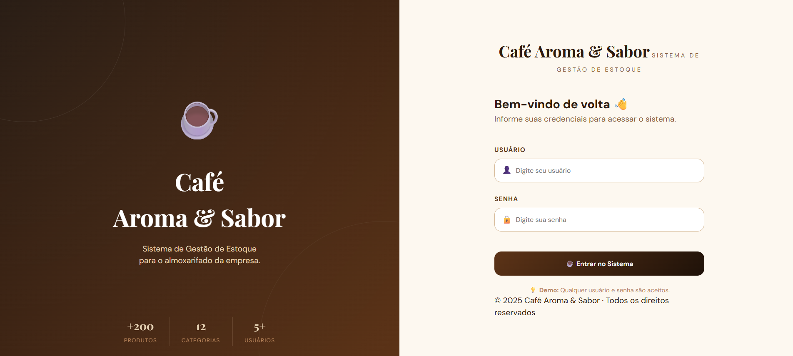
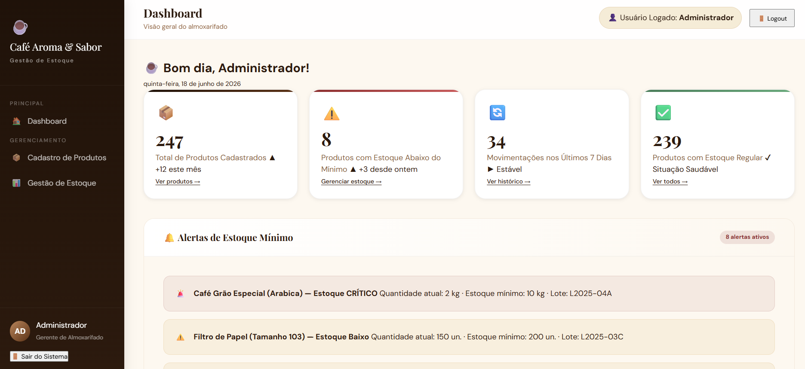
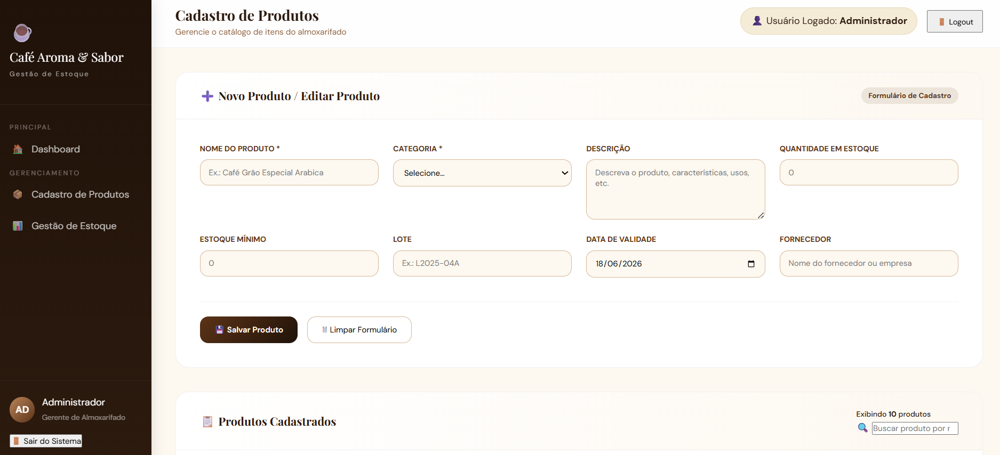
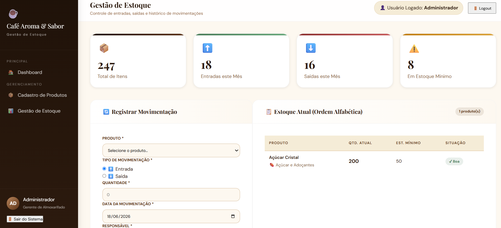

# cofearomaesabor
# cafearomaesabor

# ☕ Café Aroma & Sabor

Sistema de Gestão de Estoque desenvolvido para automatizar o controle de produtos, movimentações e monitoramento de estoque mínimo.

<p align="center">
  
</p>

<p align="center">
  <strong>Sistema desenvolvido com Spring Boot e Spring Security</strong>
</p>

---

## 📖 Sobre o Projeto

A **Café Aroma & Sabor** é uma empresa especializada na distribuição de cafés especiais, grãos importados e produtos gourmet.

Antes da implementação deste sistema, o controle de estoque era realizado por meio de planilhas manuais, causando diversos problemas operacionais:

- Perda de produtos por falta de controle.
- Falta de itens em estoque.
- Dificuldade para rastrear movimentações.
- Erros decorrentes de processos manuais.
- Baixa visibilidade das operações do almoxarifado.

Para resolver esses desafios foi desenvolvido um sistema web capaz de centralizar e automatizar todas as operações relacionadas ao estoque.

---

# 🚀 Funcionalidades

## 🔐 Autenticação de Usuários

O sistema utiliza Spring Security para proteger o acesso às funcionalidades administrativas.

### Credenciais para demonstração

```text
Usuário: admin
Senha: admin
```

### Tela de Login

<p align="center">
  
</p>

---

## 📊 Dashboard

O dashboard apresenta uma visão geral do sistema, permitindo acompanhar rapidamente as informações mais importantes do estoque.

### Recursos

- Resumo dos produtos cadastrados.
- Indicadores do estoque.
- Acesso rápido às funcionalidades.
- Monitoramento geral das operações.

<p align="center">
  
</p>

---

## 📦 Gestão de Produtos

Permite o cadastro e gerenciamento completo dos produtos disponíveis no estoque.

### Funcionalidades

- Cadastro de produtos.
- Edição de informações.
- Exclusão de registros.
- Consulta rápida.
- Controle de quantidade disponível.
- Configuração de estoque mínimo.

### Informações armazenadas

- Nome do produto.
- Descrição.
- Categoria.
- Quantidade em estoque.
- Estoque mínimo.

<p align="center">
  
</p>

---

## 📋 Gestão de Estoque

Responsável pelo controle das movimentações de entrada e saída de produtos.

### Entrada de Produtos

- Registro de reposições.
- Atualização automática do estoque.
- Registro do responsável pela movimentação.
- Histórico completo das entradas.

### Saída de Produtos

- Registro de retiradas.
- Atualização automática da quantidade disponível.
- Validação para impedir estoque negativo.
- Controle completo das movimentações.

### Benefícios

- Maior controle operacional.
- Redução de erros.
- Histórico centralizado.
- Melhor rastreabilidade.

<p align="center">
  
</p>

---

## 🚨 Controle de Estoque Mínimo

O sistema monitora automaticamente os níveis de estoque dos produtos cadastrados.

Quando a quantidade disponível atinge ou fica abaixo do valor mínimo configurado, alertas são gerados para auxiliar o processo de reposição.

### Benefícios

- Evita falta de produtos.
- Reduz perda de vendas.
- Auxilia no planejamento de compras.
- Mantém produtos populares disponíveis.

---

## 📜 Histórico e Rastreabilidade

Todas as movimentações realizadas no sistema são registradas automaticamente.

Cada registro contém:

- Produto movimentado.
- Tipo da movimentação.
- Quantidade.
- Usuário responsável.
- Data da operação.
- Horário da operação.

Isso permite identificar rapidamente qualquer alteração realizada no estoque.

---

## 🔒 Segurança

O sistema utiliza Spring Security para garantir acesso seguro às funcionalidades administrativas.

### Recursos implementados

- Autenticação de usuários.
- Controle de acesso.
- Proteção de rotas.
- Sessões seguras.

---

## ⚙️ Regras de Negócio

### Controle de Estoque

- Não é permitido estoque negativo.
- Entradas aumentam automaticamente o saldo disponível.
- Saídas reduzem automaticamente a quantidade em estoque.

### Controle de Alertas

- Um alerta é gerado quando o estoque fica abaixo do mínimo configurado.
- O alerta permanece ativo até que a reposição seja realizada.

### Controle de Histórico

- Nenhuma movimentação é removida após registro.
- Todos os registros permanecem disponíveis para consulta.

---

## 🏗️ Arquitetura

```text
Controller
    ↓
Service
    ↓
Repository
    ↓
Banco de Dados
```

### Camadas

**Controller**
- Recebe as requisições da interface.

**Service**
- Implementa as regras de negócio.

**Repository**
- Responsável pela persistência dos dados.

**Database**
- Armazena produtos, usuários e movimentações.

---

## 🛠️ Tecnologias Utilizadas

- Java
- Spring Boot
- Spring Security
- Spring Data JPA
- Hibernate
- Thymeleaf
- MySQL
- Maven
- HTML5
- CSS3
- JavaScript
- Bootstrap

---

## ▶️ Como Executar

### Clonar o Repositório

```bash
git clone https://github.com/seu-usuario/cafe-aroma-sabor.git
```

### Entrar na Pasta

```bash
cd cafe-aroma-sabor
```

### Executar o Projeto

```bash
mvn spring-boot:run
```

### Acessar

```text
http://localhost:8080
```

---

## 📈 Benefícios Obtidos

✅ Controle centralizado do estoque

✅ Redução de perdas operacionais

✅ Monitoramento automático

✅ Rastreabilidade completa

✅ Histórico de movimentações

✅ Maior produtividade

✅ Segurança das informações

✅ Facilidade de utilização

---

## 👨‍💻 Desenvolvedor

Desenvolvido por **Benett Rezende** como solução para o desafio de gestão de estoque da empresa fictícia **Café Aroma & Sabor**.

---

<p align="center">
  ☕ Café Aroma & Sabor • Sistema de Gestão de Estoque
</p>
